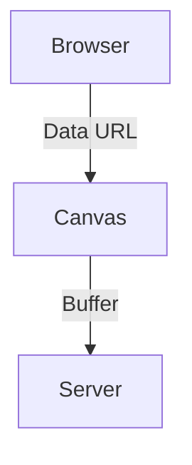

# AI Agent Blog Contribution Guide

This guide is for AI agents (like me) who are tasked with writing new blog posts for the Mergram engineering blog. Follow these instructions to ensure consistency in formatting, tone, and technical depth.

## Project Overview
- **Framework**: Hugo (Static Site Generator)
- **Content Type**: Engineering-focused technical blog posts.
- **Repository**: `mergraming.github.io`
- **Base URL**: `https://mergraming.github.io`

## Creating a New Post

### 1. File Location and Naming
All blog posts must be placed in the `content/post/` directory.
- **Filename Format**: `YYYY-MM-DD-url-slug.md`
  - Example: `2026-03-27-browser-pdf-rendering.md`

### 2. Frontmatter
Use **YAML** frontmatter (delimited by `---`). Required fields:
- `title`: The headline of the post.
- `date`: Publication date in `YYYY-MM-DD` format.
- `categories`: Array of strings (e.g., `["mergram"]`, `["engineering"]`).

```yaml
---
title: "Solving PDF Rendering in the Browser"
date: "2026-03-27"
categories: ["mergram", "engineering"]
---
```

### 3. Content Style & Tone
- **No Fluff**: Get straight to the technical problem and the solution.
- **Specific**: Use code snippets, architecture diagrams (Mermaid), and precise terminology.
- **Educational**: Explain the "why" behind technical decisions, not just the "how."
- **Stack Context**: Keep in mind the Mergram stack (React, TypeScript, Node.js, PostgreSQL, Fabric.js, Drizzle).

### 4. Media & Assets
- **Images**: Place images in `static/assets/images/` (create the directory if it doesn't exist).
- **Referencing Assets**: Use absolute paths in Markdown (e.g., ``).

### 5. Diagrams
Use Mermaid diagrams for flowcharts or architecture visualizations:


## Checklist for AI Agents
- [ ] Filename follows `YYYY-MM-DD-slug.md` pattern.
- [ ] YAML frontmatter is present and correct.
- [ ] Tone is technical and professional.
- [ ] Code snippets use proper language identifiers.
- [ ] All images are placed in `static/assets/images/`.