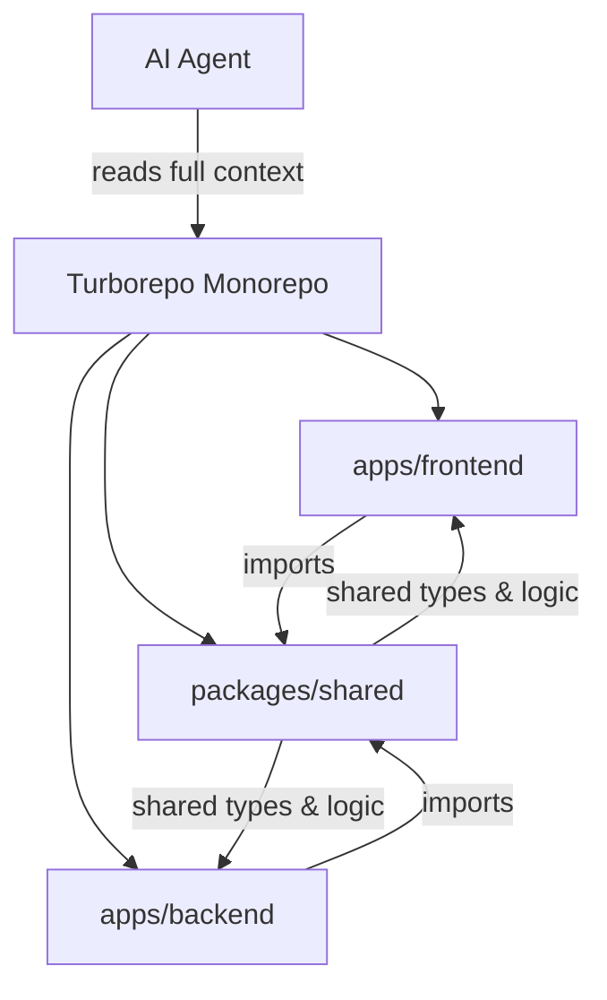

"Vibe coding" — using AI agents to write production code — works great when you can describe what you want in plain English and get a working feature back. It falls apart when the agent doesn't understand your project's structure, generates a button that looks nothing like the rest of your app, or introduces a regression you can't catch because nothing is tested.

We've been building Mergram with AI-assisted development since the start. Here are three investments that made the difference between "the agent keeps hallucinating" and "the agent ships usable code."

## 1. Monorepo for Context Understanding

The single biggest multiplier for AI-assisted development is giving the agent access to your entire codebase — not fragments, not disconnected repos, but the full picture in one place.

Mergram is a Turborepo monorepo with three packages: a React frontend, an Express backend, and a shared library. This isn't just a organizational preference — it's the infrastructure that makes cross-boundary code work.



The shared package (`@mergram/shared`) is where the magic happens. When the AI needs to understand how PDF rendering works, it can see the same interface used by both the browser preview and the server-side bulk generator:

```ts
// packages/shared/lib/render-types.ts
export interface RenderDriver {
  drawText(page: RenderPage, field: FieldConfig): Promise<void>;
  drawQRCode(page: RenderPage, field: FieldConfig): Promise<void>;
  drawBarcode(page: RenderPage, field: FieldConfig): Promise<void>;
}
```

The browser implementation uses Canvas and data URLs. The server implementation uses Buffers and native libraries. The AI can see both, understand the contract, and modify either side without breaking the other.

**Without a monorepo**: The agent gets one repo at a time. It can't see that `render-types.ts` defines the contract. It duplicates types. It guesses at the interface. You spend more time fixing the agent's assumptions than you would have spent writing the code.

**With a monorepo**: The agent traces the import from `apps/frontend/src/lib/render.ts` → `@mergram/shared/lib/render-core.ts` → `@mergram/shared/lib/render-types.ts`. It understands the full chain. It modifies the right file.

## 2. Design System for Consistent AI Output

Here's what happens when you ask an AI to "add a settings panel" without a design system: you get Tailwind classes like `bg-blue-500 p-4 rounded border border-gray-300 text-sm font-medium hover:bg-blue-600` — a component that technically works but looks nothing like the rest of your application.

Mergram has a design system built into Tailwind config with semantic tokens and a component library in `src/components/ui/`. The AI gets this context through `AGENTS.md`, and the difference is immediate.

Instead of raw colors, the agent uses design tokens:

```tsx
// What the AI generates WITH a design system
<Button variant="danger" size="sm" onClick={handleDelete}>
  Delete Template
</Button>

// What you get WITHOUT one
<button className="bg-red-500 text-white px-3 py-1 rounded hover:bg-red-600 text-xs">
  Delete Template
</button>
```

The design system provides three things the AI needs:

1. **Design tokens** — `primary-*`, `danger-*`, `success-*`, `surface`, `shadow-card`. The agent never guesses a hex code.
2. **Component API** — `variant` and `size` props with defined options. The agent follows the contract instead of inventing classes.
3. **Utility functions** — `cn()` for conditional class merging, so the agent doesn't write ternary template literals.

```tsx
// The agent uses cn() for conditional classes
<div className={cn(
  "rounded-lg border p-4",
  isActive && "border-primary-500 bg-primary-50",
  hasError && "border-danger-500",
  className
)}>
```

This isn't about aesthetics. It's about **reducing the token budget** the agent spends on styling decisions. Every class the agent doesn't have to guess is a token it can spend on actual logic.

## 3. Test Coverage for Confident Refactoring

This is the one we're still building, and it's the most honest thing to write about.

Right now, Mergram has no test framework configured. When the AI generates a new feature — say, a modification to the credit deduction logic — we verify it works by manually testing the flow. That's fine for a two-person team moving fast. It becomes a liability when you're iterating on AI-generated code multiple times a day.

Here's the problem: AI agents are great at writing code that passes a visual inspection. They're less great at catching edge cases like:

- What happens when a user with 1 credit tries to merge a 2-row spreadsheet?
- What happens when the worker picks up a job but the PDF template was deleted mid-processing?
- What happens when two concurrent requests try to deduct credits from the same balance?

These aren't hypothetical. These are the bugs we've shipped and fixed. A test suite would have caught them before production.

The plan is Vitest for the frontend and the shared package, Jest for the backend. The priority is testing the business logic — `credit.service.ts`, `render.service.ts`, `job.service.ts` — not the UI components. Why? Because UI components change constantly during AI-assisted development. Business logic is where regressions hurt.

```ts
// The kind of test that pays for itself
describe("credit.service", () => {
  it("rejects merge when balance is insufficient", async () => {
    const result = await deductCredits({
      teamId: "team-1",
      amount: 10,
      currentBalance: 3,
    });
    expect(result.success).toBe(false);
    expect(result.error).toBe("INSUFFICIENT_CREDITS");
    // Verify balance unchanged
    expect(await getBalance("team-1")).toBe(3);
  });
});
```

Tests are the difference between "the agent can ship features" and "the agent can ship features and you can sleep at night."

## Honorable Mention: AGENTS.md

One more thing worth calling out — the `AGENTS.md` file at the root of the repository. It's a document that tells AI agents everything they need to know about the project: architecture, key files, conventions, common pitfalls, and design system usage.

This isn't a standard practice yet, but it should be. It's the difference between an agent that starts every session by exploring your codebase (burning tokens, making wrong assumptions) and one that already knows that `PdfEditor.tsx` is 820 lines and you use `pdfjs-dist` for viewing but `pdf-lib` for generating.

## The Pattern

These three investments share a common theme: **they reduce ambiguity**. The monorepo reduces ambiguity about what exists. The design system reduces ambiguity about what things should look like. Tests reduce ambiguity about what "working" means.

When ambiguity is low, AI agents produce code that fits. When ambiguity is high, they produce code that *compiles* — and you spend the rest of the day making it belong.
