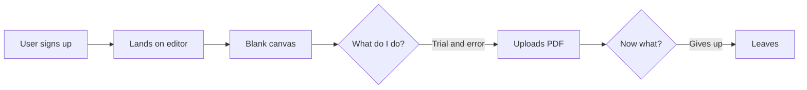
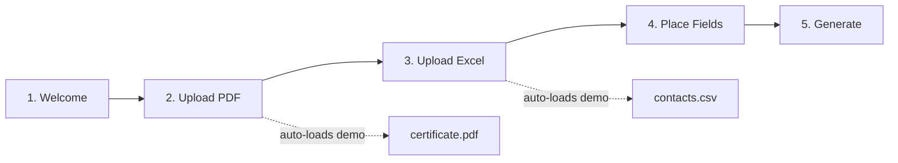
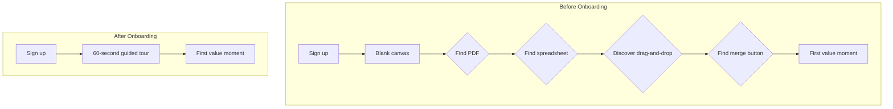

A user signs up. They land on your app. They see a sidebar with seven navigation items and a main area that's mostly empty. They click around for thirty seconds, don't understand the workflow, and leave.

That was Mergram before we added onboarding. The product worked — you could upload a PDF, load a spreadsheet, drag fields onto a canvas, and generate merged documents. But none of that mattered if the user couldn't figure out the order of operations in the first minute.

Onboarding isn't a nice-to-have. It's the difference between a user who understands your product and a user who thinks your product is broken.

## The Problem: A Powerful Editor with No Starting Point

Mergram's core flow has four steps: upload a PDF template, load a spreadsheet, place data fields on the canvas, and generate merged documents. When a new user landed on the editor, they saw a Fabric.js canvas and a sidebar. No PDF. No data. No indication of what to do first.

We had an `EmptyState` component — the reusable one with an icon, title, and action button — but it only told users to upload a file. It didn't explain *why*, or what would happen next, or how the pieces fit together. The user had to discover the entire workflow through trial and error.



The fix wasn't adding more documentation or a longer help page. It was guiding the user through the flow *inside the product*, where the actual work happens.

## What We Built: A 5-Step Interactive Tour

We built a guided tour that activates automatically on first login. It walks the user through each step of the mail merge workflow using a spotlight overlay — a dark backdrop with a cutout that highlights the relevant UI element.



The five steps map directly to the product's core workflow. Each step has a target element in the DOM, a tooltip with a description, and — critically — for the upload steps, the tour doesn't just point at a button and wait. It *auto-loads demo assets* so the user sees the editor in a populated state without having to find their own files.

## Architecture: Three Files, One Hook

The onboarding system is intentionally modular. It's split across three concerns:

**1. State management** — `useOnboarding` hook

**2. Step definitions** — `OnboardingTour` component

**3. Visual overlay** — `TourOverlay` component

### The State Hook

The hook manages the tour's lifecycle: whether it's active, which step the user is on, and how completion is tracked. It checks two sources before activating:

```ts
// useOnboarding.ts — dual-source completion check
const serverDone = session?.user?.config?.onboardingCompleted === true;

// Activate only if BOTH are false
if (!serverDone && !isOnboardingDoneLocal(userId)) {
  setIsActive(true);
  setCurrentStepIndex(0);
}
```

We use localStorage as a fast fallback and the server as the source of truth. When the user completes the tour, both are updated:

```ts
const completeTour = useCallback(() => {
  if (userId) {
    markOnboardingDoneLocal(userId);
    import("../lib/auth")
      .then(({ updateUserConfig }) =>
        updateUserConfig({ onboardingCompleted: true }),
      )
      .catch(() => {}); // Fire-and-forget
  }
  setIsActive(false);
}, [userId]);
```

The `catch(() => {})` is deliberate. Onboarding completion is a nice-to-have on the server — if the network request fails, the user still had the tour experience. They'll just see it again next session, which is an acceptable fallback.

The hook exposes a clean interface:

```ts
export interface UseOnboardingReturn {
  isActive: boolean;
  currentStep: OnboardingStep;
  stepNumber: number;
  totalSteps: number;
  next: () => void;
  skip: () => void;
  goToStep: (step: OnboardingStep) => void;
}
```

The `goToStep` method is the key to making the tour feel responsive. When the user's action in step 2 (uploading a PDF) triggers a state change in the editor, the editor can call `goToStep("upload-excel")` to advance the tour without the user having to click "Next." The tour follows the user's progress rather than forcing a rigid click-through.

### Step Definitions

Each step is a static configuration object. No logic, just data:

```ts
const STEP_CONFIGS: Record<OnboardingStep, TourStepConfig> = {
  welcome: {
    placement: "center",
    title: "Welcome to Mergram!",
    description:
      "Let's create your first mail merge. We'll walk you through " +
      "each step — uploading a PDF template, adding a spreadsheet, " +
      "and placing data fields. It only takes a minute!",
    icon: "wand-magic-sparkles",
  },
  "upload-pdf": {
    targetSelector: "[data-tour='upload-pdf']",
    placement: "bottom",
    title: "Upload Your PDF Template",
    description:
      'Click "Choose PDF Template" to upload a PDF. We\'ve already ' +
      'prepared a sample certificate for you — it will load automatically!',
    icon: ["far", "file-pdf"],
  },
  // ... three more steps
};
```

The `targetSelector` uses `data-tour` attributes on the actual DOM elements. This decouples the tour from the component internals — the editor components don't import anything onboarding-related. They just add `data-tour="upload-pdf"` to the right element, and the overlay finds it with `document.querySelector`.

This is the pattern to follow if you build something similar: **attribute selectors over component refs**. Refs tie the tour to the component tree. Attribute selectors tie it to the DOM, which is what you're actually highlighting.

### The Spotlight Overlay

The `TourOverlay` component does three things: renders a dark backdrop, cuts a spotlight hole over the target element, and positions the tooltip relative to that hole.

The spotlight is a single `div` with a massive `boxShadow`:

```ts
const spotlightStyle: React.CSSProperties = targetRect
  ? {
      position: "fixed",
      top: targetRect.top - SPOTLIGHT_PADDING,
      left: targetRect.left - SPOTLIGHT_PADDING,
      width: targetRect.width + SPOTLIGHT_PADDING * 2,
      height: targetRect.height + SPOTLIGHT_PADDING * 2,
      borderRadius: 12,
      boxShadow: "0 0 0 9999px rgba(0,0,0,0.55)",
      transition: "all 0.4s cubic-bezier(0.4, 0, 0.2, 1)",
      zIndex: 200,
      pointerEvents: "none",
    }
  : {};
```

The `boxShadow: "0 0 0 9999px ..."` trick creates the "cutout" effect. The element itself is transparent, but the shadow extends 9999 pixels in every direction, creating the dark overlay with a hole in the middle. It's simpler than SVG clip-paths and handles the transition between steps cleanly — when the target element moves or the step changes, the CSS transition animates the spotlight's position and size.

The spotlight tracks the target element via `requestAnimationFrame`:

```ts
useEffect(() => {
  if (!targetSelector) return;
  const update = () => {
    setTargetRect(getTargetRect(targetSelector));
    rafRef.current = requestAnimationFrame(update);
  };
  update();
  return () => cancelAnimationFrame(rafRef.current);
}, [targetSelector]);
```

This ensures that if the user resizes the browser, scrolls, or the layout shifts, the spotlight stays locked on the target element.

## The Demo Asset Strategy

The biggest UX insight in our onboarding was auto-loading demo files. When the tour tells the user "upload a PDF," it also loads a sample `certificate.pdf` and `contacts.csv` from the `public/onboarding/` directory:

```ts
// useOnboardingLoader.ts
const DEMO_PDF_URL = "/onboarding/certificate.pdf";
const DEMO_EXCEL_URL = "/onboarding/contacts.csv";

export function useOnboardingLoader() {
  const loadDemoPdf = useCallback(async () => {
    const response = await fetch(DEMO_PDF_URL);
    const buffer = await response.arrayBuffer();
    return { fileName: "certificate.pdf", buffer };
  }, []);
  // ... same for Excel
}
```

This is what turns a passive tour ("click here, then click there") into an active one ("watch the editor populate with real data"). The user sees the PDF render, sees the spreadsheet columns appear in the sidebar, and understands *what the product does* — not just *where to click*.

Without demo assets, the tour would be saying "upload a PDF" to a user who doesn't have a PDF handy. They'd skip the tour, and you've lost your one chance to make a first impression.

## What We Got Wrong (Or Haven't Done Yet)

The tour works, but it's not perfect. Here's what we'd change:

**No re-onboarding mechanism.** Once the tour completes, there's no way to restart it from the UI. The `restart()` method exists on the hook, but nothing in the settings or help menu calls it. If a user skips the tour, they can't get it back.

**No contextual help after the tour.** The tour runs once, then disappears. There are no tooltips, no help panels, no "what's this?" links on individual features. The user either remembers what the tour taught them or figures it out on their own.

**Steps are static, not context-aware.** The tour always shows all five steps, even if the user has already uploaded a PDF before starting the tour. An ideal system would detect the editor's current state and skip steps the user has already completed.

These are the kinds of gaps you discover after shipping. The tour solved the biggest problem — the blank-canvas moment — and the incremental improvements are on the roadmap.

## The Lesson

Onboarding isn't about making your product feel polished. It's about **reducing the time between sign-up and the first moment of value**.

Before the tour, a new user had to: find their own PDF, find their own spreadsheet, figure out which goes first, discover the drag-and-drop mechanic, and find the merge button. That's five cognitive jumps, any one of which could be the jump where they leave.

After the tour: the user watches the product work with demo data in about sixty seconds. They understand the workflow. They've seen the canvas, the sidebar, and the merge button in context. When they bring their own files, they already know where everything goes.



If you're building a product where the user needs to understand a multi-step workflow before they can get value — and most products are like this — the onboarding tour isn't a feature you add later. It's the first feature you ship.
