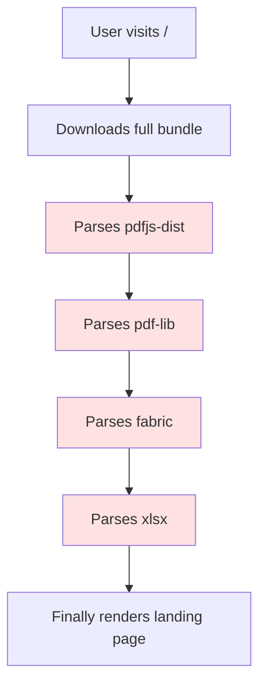
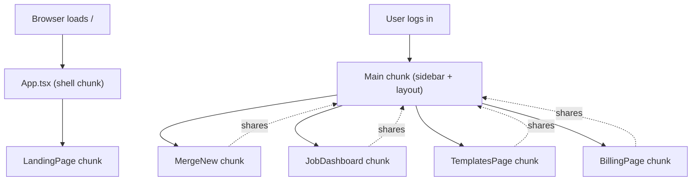

Mergram's editor pulls in `pdfjs-dist` for viewing PDFs, `pdf-lib` for generating them, `fabric` for the canvas overlay, and `xlsx` for spreadsheet parsing. The landing page needs none of these. But in a single-bundle SPA, every visitor downloads the entire PDF engine — even the ones who bounce off the pricing page.

The fix is code splitting: load only what each route needs. But splitting introduces its own problem — what happens when a chunk fails to load?

## The Cost of a Single Bundle

The problem isn't just bandwidth. It's parse time. The browser has to download, parse, and compile the entire bundle before it can render *anything*. If the user only wants the landing page, they're waiting for `pdf-lib` to compile before they see a single pixel of the hero section.



Every red box is JavaScript the landing page never uses. The user paid for it in download time and CPU time, and it did nothing.

## How We Chunk: Two-Tier Lazy Loading

We split the routes into two tiers based on layout and authentication boundary.

**Tier 1: `App.tsx`** — the root level. Handles unauthenticated routes: landing pages, login, legal pages, and standalone tools. Each is a separate chunk.

```ts
// App.tsx — lazy-loaded route components (each becomes a separate chunk)

// Landing / marketing pages
const LandingPage = lazy(() => import("./components/landing/LandingPage"));
const ToolsLandingPage = lazy(
  () => import("./components/landing/ToolsLandingPage"),
);

// Standalone tools (each pulls in pdf-lib / fabric / xlsx independently)
const SimplePdfEditor = lazy(
  () => import("./components/tools/SimplePdfEditor"),
);
const PdfCompressor = lazy(() => import("./components/tools/PdfCompressor"));

// Authenticated workspace (heaviest — editor, billing, jobs, etc.)
const Main = lazy(() => import("./components/Main"));
```

**Tier 2: `Main.tsx`** — the authenticated workspace. Loaded only after login. Contains the editor, billing, jobs, templates, and everything else behind the sidebar. These are *nested* lazy imports inside the already-lazy-loaded `Main` chunk.

```ts
// Main.tsx — lazy-loaded workspace routes
const BillingPage = lazy(() => import("./billing/BillingPage"));
const MailMerge = lazy(() => import("./merge/MailMerge"));
const JobDashboard = lazy(() => import("./jobs/JobDashboard"));
const TemplatesPage = lazy(() => import("./templates/TemplatesPage"));
```

The two-tier structure means navigating between workspace pages (e.g., from jobs to templates) doesn't re-download the sidebar, auth logic, or layout shell. Only the page-specific code is fetched.



Each tool page is also its own chunk. The PDF compressor imports `pdf-lib` but not `fabric`. The QR code generator imports neither. Users who only visit `/tools/qr-code-generator` never download the PDF engine.

## The Suspense + Error Boundary Sandwich

`React.lazy` returns a promise. If the promise rejects — network timeout, stale deployment, CDN hiccup — React throws. Without an error boundary, the entire app unmounts. White screen.

We wrap every lazy-loaded route tree in the same pattern:

```tsx
<Suspense fallback={<LoadingFallback />}>
  <ChunkErrorBoundary variant="fullscreen">
    <AppRoutes />
  </ChunkErrorBoundary>
</Suspense>
```

**`Suspense`** handles the loading state while the chunk downloads. **`ChunkErrorBoundary`** handles the failure state when the download fails. They're complementary — `Suspense` is for the expected case, the error boundary is for the broken case.

The `LoadingFallback` has two variants: `fullscreen` for root-level routes (covers the viewport with a centered spinner and logo) and `inline` for workspace routes (fits within the sidebar layout so the user doesn't lose context).

## ChunkErrorBoundary: Retry Without Losing Your Mind

The `ChunkErrorBoundary` does one job: when a chunk fails to load, give the user a way to recover without losing their place.

The first challenge is detection. Chunk errors come from the bundler, not your code, and the error messages vary between Vite and webpack:

```ts
// ChunkErrorBoundary.tsx — error detection
function isChunkLoadError(error: Error): boolean {
  const msg = error.message.toLowerCase();
  return (
    msg.includes("loading chunk") ||
    msg.includes("failed to fetch dynamically") ||
    msg.includes("importing a module script failed") ||
    msg.includes("loading css chunk") ||
    msg.includes("networkerror") ||
    msg.includes("failed to load script")
  );
}
```

The second challenge is retry. A chunk failure usually means the browser cached an old `index.html` that references a JavaScript file that no longer exists on the server. The only reliable fix is a full page reload — you can't just re-call the dynamic import because the ES module cache will return the same failed promise.

```ts
// ChunkErrorBoundary.tsx — retry handler
handleRetry = (): void => {
  const retryCount = getRetryCount(this.storageKey);
  if (retryCount >= MAX_RETRIES) return;

  setRetryCount(this.storageKey, retryCount + 1);
  this.setState({ isRetrying: true });

  // Full page reload is the only reliable way to clear the ES module cache
  // so the browser re-fetches the failed chunk from the server.
  window.location.reload();
};
```

The retry count lives in `sessionStorage`, keyed by the current pathname. This is deliberate — `sessionStorage` survives `window.location.reload()` but doesn't persist across tabs or sessions. If the user has retried twice and it still fails, we show a "Reload page" button instead of "Retry," because the problem isn't a transient network glitch. It's a stale deployment that requires a fresh navigation.

```ts
// Hydrate retry count from sessionStorage (survives page reload)
constructor(props: ChunkErrorBoundaryProps) {
  super(props);
  const retryCount = getRetryCount(this.storageKey);
  this.state = {
    hasError: false,
    isChunkError: false,
    retryCount,
    isRetrying: false,
    error: null,
  };
}
```

The boundary also does something subtle but important: non-chunk errors are re-thrown to the parent boundary.

```ts
componentDidCatch(error: Error, _info: ErrorInfo): void {
  // Re-throw non-chunk errors so the top-level SentryErrorBoundary handles them
  if (!isChunkLoadError(error)) {
    throw error;
  }
}
```

If a lazy-loaded component crashes because of a bug — not because of a missing chunk — that's a real error. It should be caught by the Sentry error boundary, reported, and shown as an error page. The `ChunkErrorBoundary` only handles infrastructure failures, not application errors. The separation keeps the retry logic focused and prevents masking real bugs behind a "click to retry" button.

## Sentry: Filtering the Noise

Chunk load errors are the most common error in any deployed SPA, and they're almost never actionable. They happen during deployments when a user's browser has an old `index.html` cached. Sentry would drown in them if we didn't filter them out.

```ts
// sentry.ts — filter deployment noise
beforeSend(event) {
  // Ignore chunk load errors (common during deployments)
  if (event.exception?.values?.[0]?.value?.includes("ChunkLoadError")) {
    return null;
  }
  return event;
}
```

Dropping these events from Sentry doesn't mean we don't care about the user's experience. It means we handle it in the UI (via `ChunkErrorBoundary`) rather than in our error tracking. The user gets a retry button. Our alerting stays clean.

## The Lesson

Chunking is not optional for SPAs that pull in heavy libraries. The alternative is making every visitor pay for code they'll never execute.

But chunking introduces a failure mode that most tutorials ignore: what happens when a chunk doesn't load. The answer can't be "the user sees a white screen." It has to be: the user sees a clear message, gets a working retry mechanism, and the error is handled in the right layer — the UI, not the error tracker.

The pattern is simple: `Suspense` for the expected case, `ChunkErrorBoundary` for the broken case, `sessionStorage` for retry state, and `beforeSend` to keep Sentry clean. Four pieces that together turn a deployment artifact into a recoverable experience.
