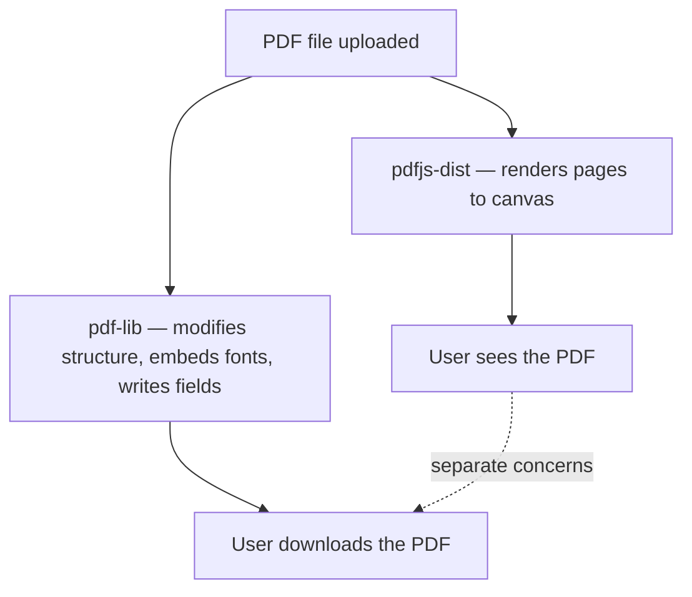
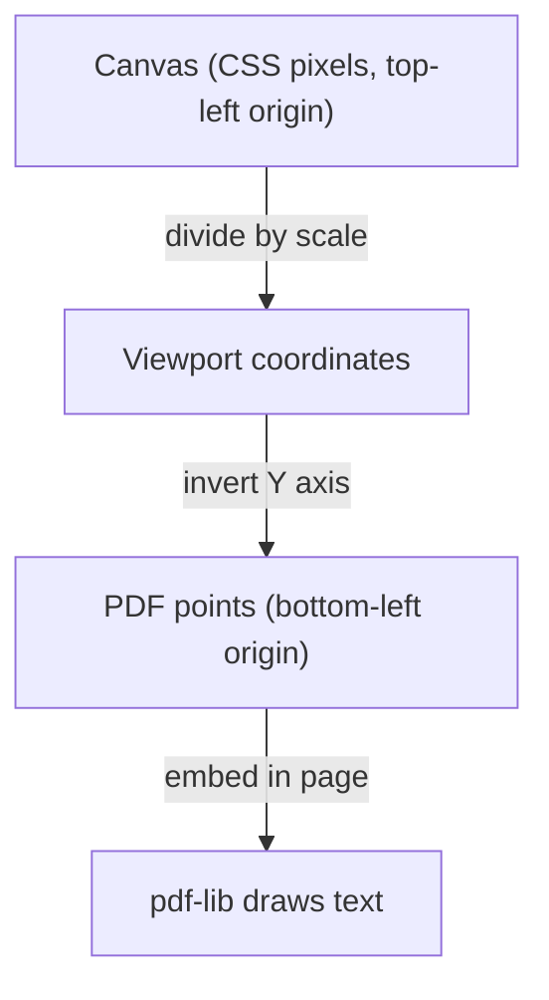
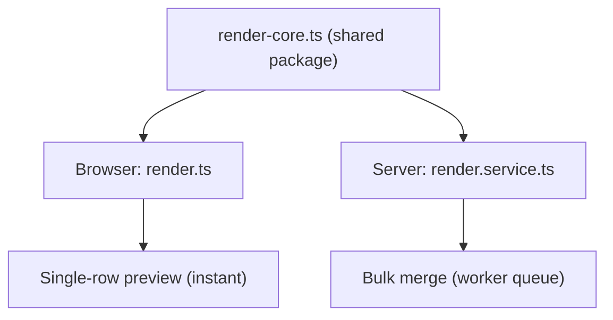

A PDF is not a document. It's a rendering instruction set. Every glyph, every line, every image is placed at an absolute (x, y) coordinate on a fixed-size canvas measured in points — not pixels. There is no reflow. There is no "just add text here." There is a coordinate system, a font embedding protocol, and 1,300 pages of ISO specification.

We learned this the hard way while building Mergram's editor. Here are the problems that surprised us.

## Two Libraries, Two Jobs

There is no single JavaScript library that can both *display* and *generate* PDFs well. So we use two: `pdfjs-dist` (Mozilla's PDF.js) for viewing, and `pdf-lib` for generation.



This split sounds clean until you realize they don't agree on anything. PDF.js renders pages at screen resolution using pixel coordinates. pdf-lib operates in PDF points (1/72 of an inch). The user places a field on the canvas at pixel (400, 300), and you need to convert that to a point position on the correct PDF page — accounting for scale, viewport offset, and the fact that PDF's y-axis goes upward while the browser's goes downward.

```ts
// Pixel on canvas → point position in PDF
// Two different coordinate systems, one conversion
const pdfX = canvasX / scale;
const pdfY = pageHeight - canvasY / scale;
```

That `pageHeight - y` inversion is where the first bugs live. Forget it once, and every field lands in the wrong position — mirrored vertically.

## The Coordinate System Hall of Mirrors

A user drags a field onto the canvas. The Fabric.js overlay fires an event with `{ left: 342, top: 187 }`. Those are CSS pixels relative to the canvas element. But the PDF page underneath was rendered at a specific zoom level, and the PDF's internal coordinate system starts at the bottom-left corner.



Three coordinate spaces, two transformations, and any rounding error compounds. A field that's 1 pixel off at 100% zoom is 2 pixels off at 200% zoom. We ended up with a shared conversion utility that every rendering path goes through — no ad-hoc math in component code.

The Fabric.js canvas overlay sits on top of a PDF.js rendered page. The overlay shows draggable field boxes. The PDF underneath is a static image. They need to stay perfectly aligned across zoom changes, window resizes, and page scrolls. If the overlay shifts by even a few pixels, the user places a field that renders in the wrong spot on the generated PDF.

## Unicode: The Silent Killer

PDF has 14 standard fonts (Helvetica, Times Roman, Courier, etc.). These only cover the WinAnsi character set — basically Western European text. The moment someone types a Vietnamese name like "Nguyễn Thị Minh Khai" or a Greek address, the standard fonts throw an error. The character "ễ" doesn't exist in WinAnsi.

The fix is to embed a Unicode-capable font (we use Inter) and tell pdf-lib to regenerate all form field appearances using that font instead of the default:

```ts
// Detect non-ASCII and switch to Unicode font
if (hasNonAsciiChars(value)) {
  needsUnicodeFont = true;
}

// Later: embed Inter and regenerate appearances
if (needsUnicodeFont) {
  const unicodeFont = await embedUnicodeFont(pdfDoc);
  pdfForm.updateFieldAppearances(unicodeFont);
}
```

This sounds simple. The catch is that `updateFieldAppearances` regenerates *every* field's visual appearance, not just the ones with Unicode. If the PDF had carefully styled form fields with custom fonts and sizes, they all get overwritten with your Unicode font. You trade correct encoding for lost formatting. There is no middle ground in pdf-lib's API.

## Broken PDFs Are the Norm

You'd be amazed how many PDF generators produce broken files. The form fields look fine in Adobe Reader, but internally their appearance streams point to objects that don't exist in the file. These are called dangling references, and they crash pdf-lib when it tries to save:

```ts
// The widget says "render me using object #47"
// But object #47 doesn't exist in the PDF
const AP = widget.AP();
const normalEntry = AP.get(PDFName.of("N"));
if (normalEntry === undefined) {
  // Dangling reference — remove the broken appearance
  widget.dict.delete(PDFName.of("AP"));
}
```

Adobe Reader handles this gracefully by regenerating the appearance. pdf-lib does not — it throws `UnexpectedObjectTypeError` and the merge fails. So we built a repair function that walks every form field's widget annotations, checks if their appearance references resolve, and strips the broken ones before pdf-lib touches the file.

This repair step runs on every upload. Most users never know their PDF was broken. That's the goal.

## The Same Code, Two Runtimes

Single-row previews run in the browser for instant feedback. Bulk merges run on the server via a background worker. Both need the same rendering logic — same field placement, same font handling, same QR code embedding, same barcode generation. If they diverge, the preview doesn't match the output.



The shared `render-core` package handles the logic that's runtime-agnostic: field positioning, text wrapping, form field mapping, coordinate conversion. The browser and server each provide a "driver" — an adapter that resolves fonts, embeds images, and handles platform-specific APIs. The browser driver fetches fonts over HTTP. The server driver reads them from S3.

The tricky part is font embedding. pdf-lib needs the raw font bytes to embed them. In the browser, we fetch custom fonts from the API. On the server, we download them from storage. Both paths must produce identical PDF output. If the font file differs by even one byte, the PDFs diverge. We cache fonts per merge job on the server side to avoid re-downloading the same font for every row.

## The Canvas Overlay That Isn't a PDF

Fabric.js gives us a nice drag-and-drop canvas. But Fabric.js knows nothing about PDFs. It works in CSS pixels. It doesn't understand page boundaries, PDF boxes, or the difference between "this field is on page 1" and "this field is on page 2."

When the user scrolls to page 3 and places a field, we have to track which page is currently visible and tag the field with that page index. When they zoom, the canvas objects scale, but the underlying PDF coordinates don't. When they switch pages, we serialize the current page's fields, clear the canvas, load the new page's PDF image, and deserialize the new page's fields.

Every field stores its position in PDF points, not canvas pixels. The canvas is just a visualization layer. When the user moves a field, we convert back to PDF coordinates immediately. Nothing is stored in pixel space.

## The Lesson

PDF was designed for print — a final output format where the document looks the same on every device. Building an interactive editor on top of it means fighting the format's assumptions at every turn. There is no text reflow. There is no layout engine. There are absolute coordinates, embedded fonts, and the hope that the PDF you received was generated correctly.

The hard parts aren't the obvious ones. Everyone expects rendering to be tricky. The surprises are the coordinate system inversions, the Unicode font fallbacks, the dangling references in "working" PDFs, and the fact that your browser code and server code must produce bit-identical output despite running on different runtimes with different font loading mechanisms.

We handle this by keeping the rendering logic in a shared package with platform-specific drivers, running a repair step on every upload, and treating the canvas overlay as a thin visualization layer over PDF coordinates. The user sees a drag-and-drop editor. Underneath, it's coordinate math, font embedding, and defensive parsing — every single time.
