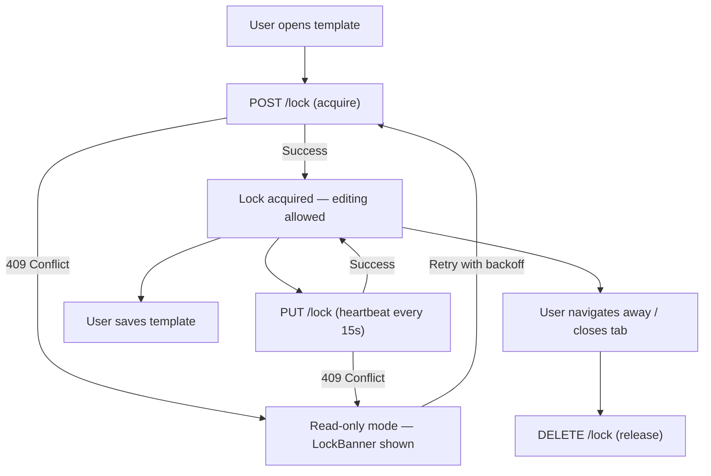
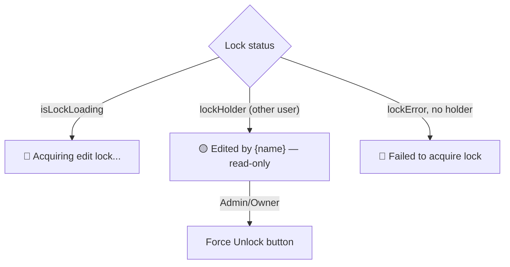

Two team members open the same template. One places a field in the top-left corner and saves. The other places a different field in the same spot and saves thirty seconds later. The first user's work is gone. No warning. No merge conflict. Just silently overwritten.

This is the last-write-wins problem, and it's the default behavior of any app that lets multiple users edit the same resource without coordination. Mergram's editor is a canvas-based tool where field placement, sizing, and styling all matter — a silent overwrite doesn't just lose a text change, it loses spatial layout decisions that are hard to reproduce.

We needed a locking system that was more robust than "disable the save button" but less oppressive than "lock the entire template and block everyone else." Here's what we built.

## The Lock Lifecycle

The system works on a simple principle: when a user opens a template for editing, they acquire a lock. While they hold the lock, they're the only one who can save. The lock expires if they go idle, and it's released when they navigate away or close the tab.



The key insight is that the lock isn't permanent and it isn't enforced at the save endpoint. It's enforced in the UI — the editor disables save actions when the lock isn't held. The server's role is to mediate lock acquisition and detect conflicts.

## Backend: Atomic Acquire with Row Locking

The lock is stored directly on the `templates` table: three columns — `lockedBy` (user UUID), `lockedByTab` (string), and `lockedAt` (timestamp). No separate lock table, no distributed coordination, no Redis.

Acquiring a lock happens inside a PostgreSQL transaction with `SELECT ... FOR UPDATE`, which prevents two concurrent requests from both reading "unlocked" and proceeding to acquire:

```ts
// template.service.ts — atomic lock acquisition
async acquireLock(
  templateId: string,
  teamId: string,
  userId: string,
  tabId: string,
): Promise<LockInfo | null> {
  return await db.transaction(async (tx) => {
    // Lock the row for atomic check-and-update
    const [row] = await tx
      .select({
        lockedBy: templates.lockedBy,
        lockedByTab: templates.lockedByTab,
        lockedAt: templates.lockedAt,
      })
      .from(templates)
      .where(and(eq(templates.id, templateId), eq(templates.teamId, teamId)))
      .for("update");

    if (!row) return null;

    // If locked by another user OR another tab, check for staleness
    if (row.lockedBy) {
      const isDifferentUser = row.lockedBy !== userId;
      const isDifferentTab = row.lockedByTab !== tabId;

      if (isDifferentUser || isDifferentTab) {
        const staleThresholdMs = Date.now() - LOCK_STALE_MINUTES * 60 * 1000;

        if (
          row.lockedAt &&
          new Date(row.lockedAt).getTime() > staleThresholdMs
        ) {
          throw new TemplateLockedError(
            isDifferentUser
              ? "Template is locked by another user"
              : "Template is open in another tab/device",
            holder,
            row.lockedAt,
          );
        }
      }
    }

    // Acquire or refresh the lock
    await tx.update(templates).set({
      lockedBy: userId,
      lockedByTab: tabId,
      lockedAt: now,
    });
  });
}
```

The `FOR UPDATE` row lock is the critical piece. Without it, two requests arriving at the same millisecond could both read the lock as available and both write their own lock — a race condition. `FOR UPDATE` serializes access: the second transaction waits for the first to commit, then sees the updated lock.

The stale threshold is 2 minutes (`LOCK_STALE_MINUTES = 2`). Since heartbeats fire every 15 seconds, a lock becomes stale after approximately 4 missed heartbeats — enough tolerance for a flaky network without leaving locks around indefinitely.

When the lock is held by someone else, the server throws `TemplateLockedError` with a 409 status and includes the lock holder's name in the response. The frontend uses this to show who's editing:

```ts
// errors.ts
export class TemplateLockedError extends TeamError {
  constructor(
    message: string,
    public readonly lockedBy: { id: string; name: string } | null = null,
    public readonly lockedAt: string | null = null,
  ) {
    super(message, 409);
  }
}
```

## Frontend: The useTemplateLock Hook

The `useTemplateLock` hook manages the entire client-side lifecycle. It's a `useReducer`-based state machine with eight action types — not because we love complexity, but because the lock has that many distinct states.

The hook handles five concerns:

**1. Acquire on mount.** When a template loads, the hook sends a `POST /lock` request with the user's ID and a unique `tabId` (generated per browser tab). The `tabId` is what distinguishes "me on another tab" from "another user."

**2. Heartbeat.** Every 15 seconds, a `PUT /lock` refreshes the `lockedAt` timestamp. If the heartbeat fails with a 409, the lock was taken by someone else — the editor drops into read-only mode.

**3. Exponential backoff retry.** When acquisition fails because someone else holds the lock, the hook retries automatically: 5s, 10s, 20s, 30s (cap). As soon as the other user releases the lock, the retry succeeds and the editor becomes writable again.

```ts
// useTemplateLock.ts — retry with backoff
const startRetry = useCallback(
  (id: string, signal?: AbortSignal) => {
    clearTimers();
    let attempt = 0;

    const scheduleRetry = () => {
      const delay = Math.min(
        RETRY_INITIAL_MS * RETRY_BACKOFF_FACTOR ** attempt,
        RETRY_MAX_MS, // 30s cap
      );
      attempt++;

      retryTimerRef.current = setTimeout(async () => {
        try {
          const result = await acquireTemplateLock(id, tabIdRef.current, signal);
          if (result.locked && result.lockedBy) {
            dispatch({ type: "ACQUIRE_SUCCESS", id });
            startHeartbeat(id, signal);
            return;
          }
        } catch { /* still locked — continue backoff */ }
        if (mountedRef.current) scheduleRetry();
      }, delay);
    };

    scheduleRetry();
  },
  [clearTimers, startHeartbeat],
);
```

**4. Release on unmount.** When the user navigates away or closes the tab, the hook sends a `DELETE /lock` to release immediately. It also registers a `beforeunload` handler as a fallback — using `fetch` with `keepalive: true` so the request survives page teardown:

```ts
// useTemplateLock.ts — beforeunload fallback
const handleBeforeUnload = () => {
  if (templateIdRef.current) {
    fetch(
      `/api/templates/${templateIdRef.current}/lock?tabId=${tabIdRef.current}`,
      { method: "DELETE", credentials: "include", keepalive: true },
    ).catch(() => {});
  }
};
```

The `keepalive: true` flag is essential here. A normal `fetch` would be cancelled when the page unloads, meaning the lock would never release and would have to wait for the 2-minute stale threshold. With `keepalive`, the browser queues the request and sends it even after the page is gone.

**5. Force release.** Admins and owners can override a lock held by someone else. The hook exposes a `forceRelease()` method that releases the current lock and immediately re-acquires it for the calling user. A `forceReleaseInProgressRef` prevents double-clicks.

## The LockBanner: Three States, One Component

When the user can't edit, they need to know why. The `LockBanner` component renders at the top of the editor with three visual states:



- **Loading** — blue, shows a spinner. The user sees this for the fraction of a second while the initial acquire request is in-flight.
- **Conflict** — amber, shows the lock holder's name with an underline. The editor switches to read-only mode. Admins and owners see a "Force Unlock" button.
- **Error** — red, shown when the acquire request fails for a non-conflict reason (network error, server error). Suggests refreshing.

The banner is informational, not blocking — the user can still scroll and inspect the template while waiting for the lock.

## The Worker Safety Net

Heartbeats and `beforeunload` handlers cover the normal cases. But browsers crash, laptops close mid-edit, and network connections drop without triggering `beforeunload`. In those scenarios, the lock sits in the database indefinitely.

The background worker — which already polls for merge jobs — runs a stale lock recovery pass alongside its other periodic tasks:

```ts
// workers/loop.ts — recover stale template locks
export async function recoverStaleTemplateLocks() {
  const staleThreshold = new Date(
    Date.now() - LOCK_STALE_MINUTES * 60 * 1000,
  ).toISOString();

  const result = await db
    .update(templates)
    .set({ lockedBy: null, lockedByTab: null, lockedAt: null })
    .where(
      and(
        sql`${templates.lockedBy} IS NOT NULL`,
        lt(templates.lockedAt, staleThreshold),
      ),
    )
    .returning({ id: templates.id });
}
```

This runs every 5 minutes. Any lock whose `lockedAt` timestamp is older than 2 minutes gets cleared. The 2-minute threshold and 15-second heartbeat interval mean a lock is recovered within ~5 minutes of the user going offline — fast enough to be useful, slow enough to tolerate network hiccups.

The same worker also recovers stale *job* locks with a similar pattern, using `lockedBy` and `lockedAt` columns on the `jobs` table. The principle is identical: if a worker process crashes mid-job, another worker picks it up after the stale threshold passes.

## The Lesson

Locking is one of those features that's invisible when it works and catastrophic when it doesn't. The challenge isn't the happy path — it's the edge cases: the user who opens three tabs, the heartbeat that fails because of a proxy timeout, the `beforeunload` that doesn't fire on mobile Safari.

The system works because every layer has a fallback. The heartbeat keeps the lock alive. The stale threshold reclaims abandoned locks. The `beforeunload` handler releases on navigation. The worker cleans up what the browser couldn't. The retry loop polls for availability. The `LockBanner` tells the user what's happening instead of silently disabling the save button.

None of these pieces is complicated on its own. Together, they cover the gap between "theoretically correct" and "works in production."
